# WEB-DEVELOPMENT-PROJECT-IRANZI-CLAUDE-223005124

The repository demonstrates front-end layout work, client-side JavaScript logic, and PHP/MySQL form processing.

## Table of Contents

1. Project Overview
2. Technology Stack
3. Quick Start
4. Project Details
5. Database Setup
6. Screenshots
7. Author

## Project Overview

| Project   | Focus Area                                      | Folder       |
| --------- | ----------------------------------------------- | ------------ |
| Project 1 | Static website layout and page structure        | `Project_1/` |
| Project 2 | Student registration form with PHP and MySQL    | `Project_2/` |
| Project 3 | Multi-page hotel website with admin login and data storage | `Project_3/` |
| Project 4 | Currency converter using JavaScript             | `Project_4/` |

## Technology Stack

- HTML5
- CSS3
- JavaScript (Vanilla)
- PHP (Procedural)
- MySQL

## Quick Start

### Static Projects

Open these files directly in your browser:

- `Project_1/index.html`
- `Project_4/index.html`

### PHP Projects

From each project folder, run:

```bash
php -S localhost:8000
```

Then open:

- `http://localhost:8000/index.php` for Project 2
- `http://localhost:8000/index.php` for Project 3

## Project Details

### Project 1: Static Website Layout

**Folder:** `Project_1/`

**Highlights:**

- Search bar header
- Sidebar navigation
- Main content with hero image and descriptive text

**Main files:**

- `Project_1/index.html`
- `Project_1/styles.css`

### Project 2: Student Registration Form

**Folder:** `Project_2/`

**Highlights:**

- Full student registration form
- Form validation on submission
- Data insertion using prepared statements
- Success/error feedback messaging

**Main files:**

- `Project_2/index.php` (form interface)
- `Project_2/submit.php` (submission handler)
- `Project_2/config.php` (database connection helper)
- `Project_2/styles.css`

### Project 3: Claudi Hotel Website

**Folder:** `Project_3/`

**Highlights:**

- Multi-page hotel and restaurant website
- Gallery with six local food and drink images that prefill the order form
- Order form and contact form persisted to MySQL
- Admin authentication and protected orders page
- Shared header/footer architecture

**Main files:**

- `Project_3/index.php`
- `Project_3/menu.php`
- `Project_3/gallery.php`
- `Project_3/order.php`
- `Project_3/contact.php`
- `Project_3/login.php`
- `Project_3/orders.php`
- `Project_3/auth.php`
- `Project_3/config.php`
- `Project_3/database.sql`

### Project 4: Currency Converter App

**Folder:** `Project_4/`

**Highlights:**

- Amount input
- Currency selector
- Exchange-rate input
- Instant converted result display

**Main files:**

- `Project_4/index.html`
- `Project_4/styles.css`
- `Project_4/main.js`

## Database Setup

### Project 2 Screenshots

- Database name: `student_portal`
- Configure credentials in `Project_2/config.php`

### Project 3 Screenshots

- Database name: `hotel_portal`
- Configure credentials in `Project_3/config.php`
- Import `Project_3/database.sql` to create the required tables and default admin user
- Required tables used by the code:
  - `admins`
  - `food_orders`
  - `contact_messages`

### Default Local Credentials

- Host: `localhost`
- Username: `root`
- Password: empty

## Screenshots

### Project 1

Static website interface showing page layout and CSS-based structure.

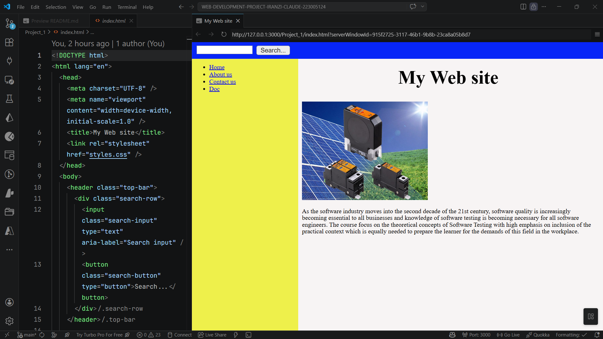

### Project 2

Student registration form UI for collecting academic records.

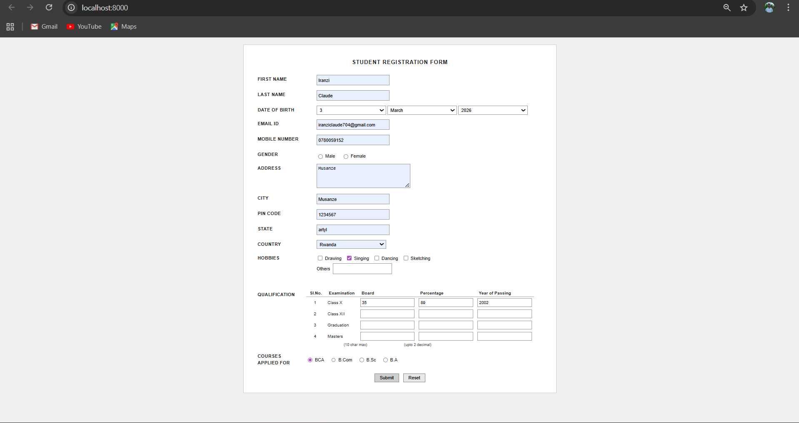

Database table output confirming registered student records are stored correctly.

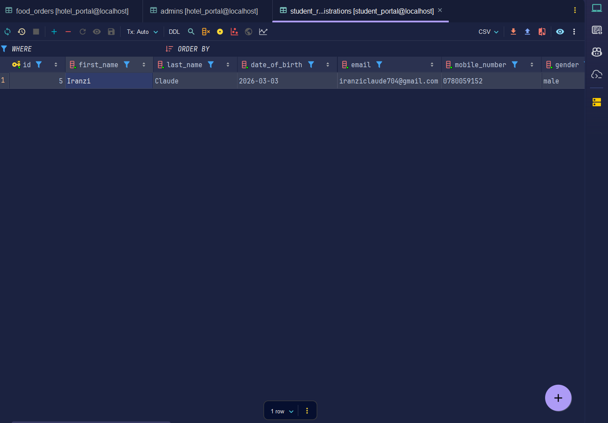

### Project 3

Home page of the hotel website (part of the required minimum 6 pages).

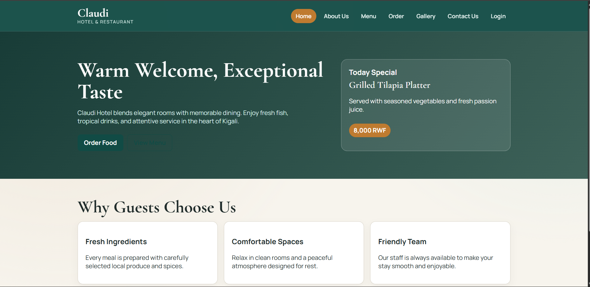

Menu page using an HTML table to present food and drink items.

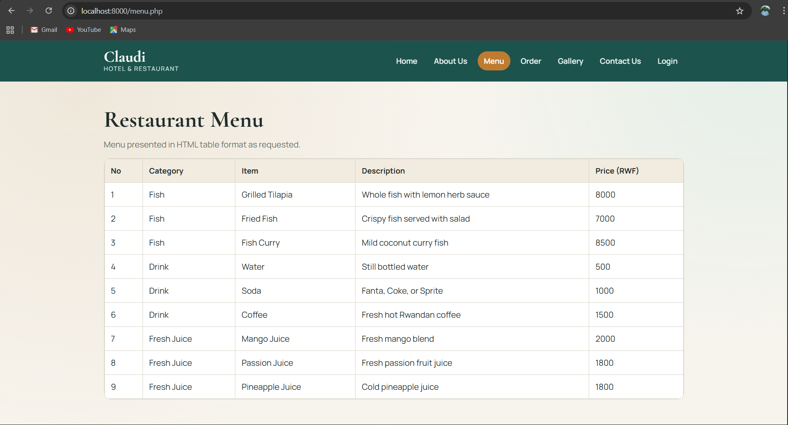

Gallery page with six local food and drink images linked directly to the order form.

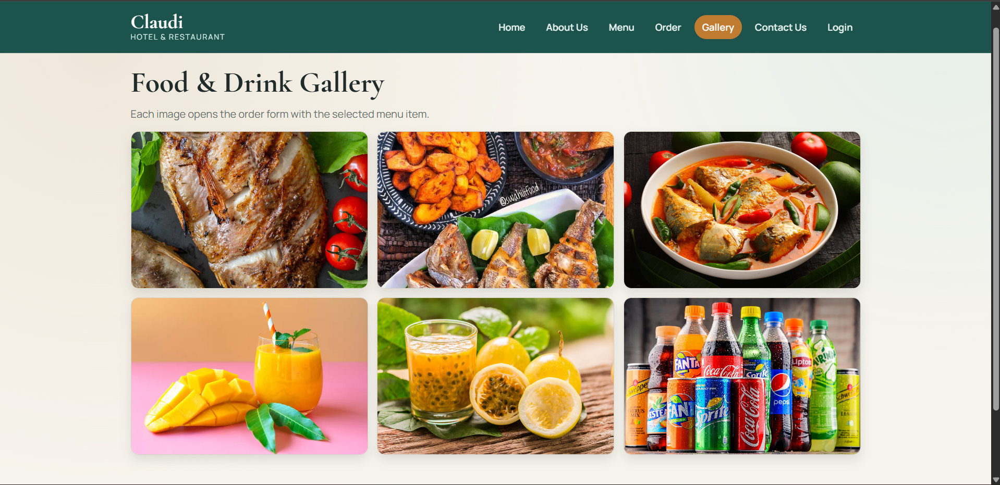

Order form page that sends customer order details to the database using PHP.

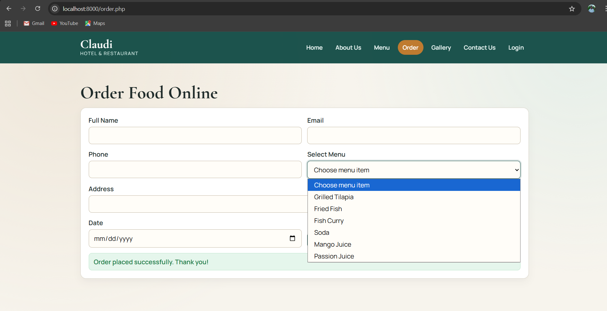

Login form used to authenticate the user before viewing stored order information.

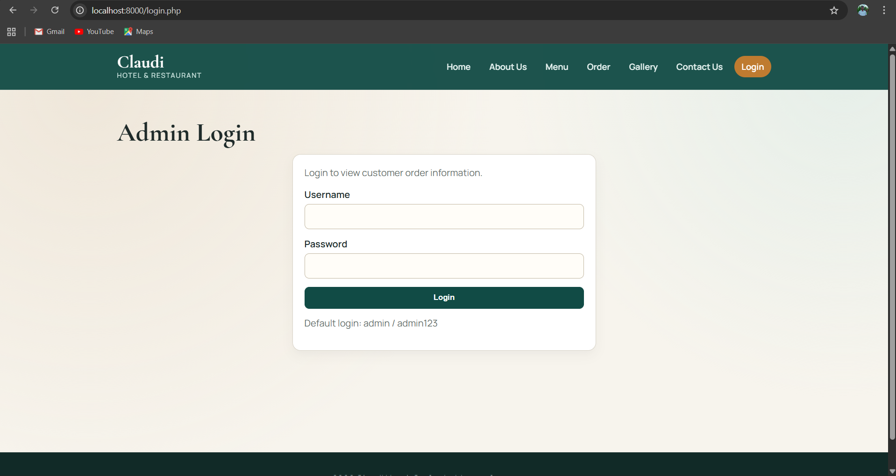

Admin dashboard after successful login, including protected navigation and logout access.

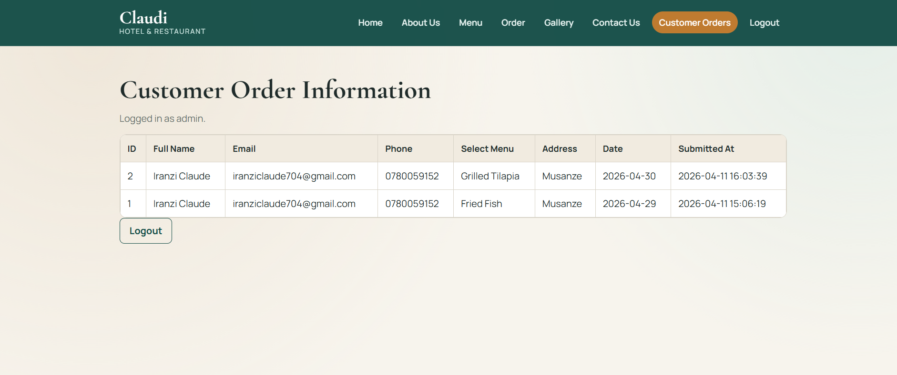

Orders table page displaying customer order data retrieved from the database.

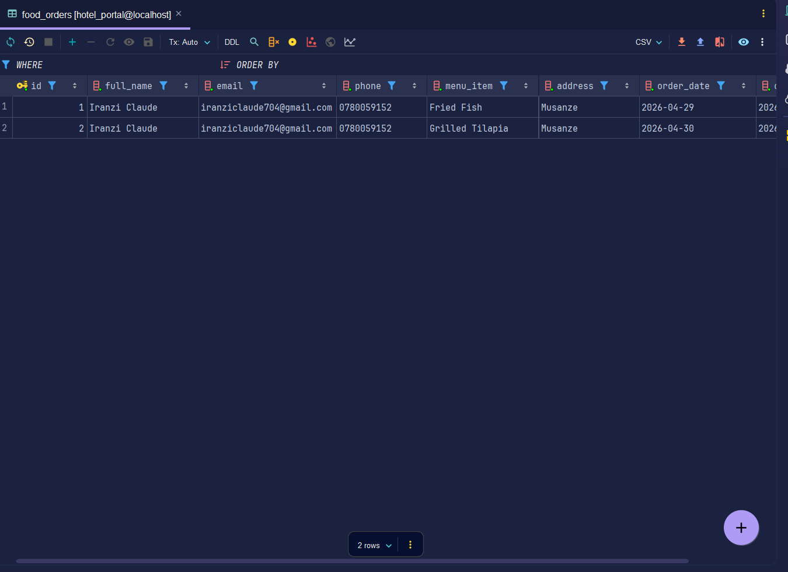

### Project 4

Currency converter interface with amount input, currency type selector, exchange rate field, and converted amount output.

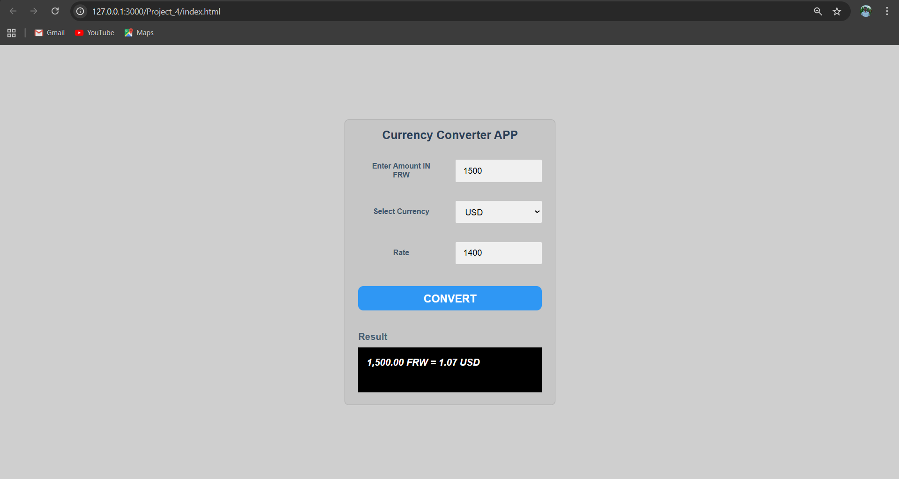

## Author

IRANZI CLAUDE 223005124
